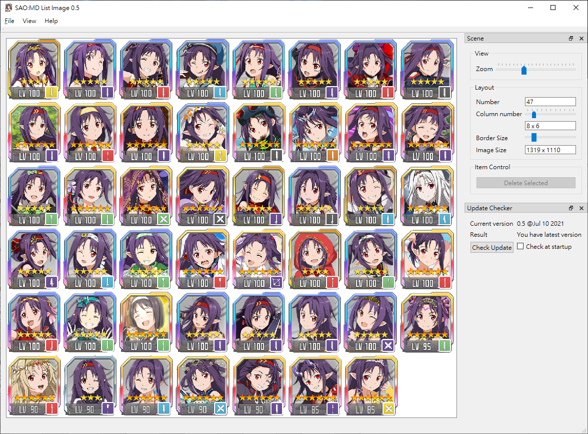

# SAOMD-ListImage

## 簡介 (Introduction)

這是一個用來重新排版《刀劍神域：記憶重組》的角色列表圖的小工具，主要功能是將數張腳色列表的截圖合併，同時也避免在合併截圖後產生一張超長的圖檔。

This is a small tool to layout the character list image of "Sword Art Online: Memory Defrag".
This tool is used to comine multiple screenshot of character list in game, and avoid generate a super long image.

## 使用環境 (Runtime Environment)
- Windows 10 x64 2004+
- [Microsoft Visual C++ Redistributable for Visual Studio 2019](https://aka.ms/vs/16/release/vc_redist.x64.exe)

## 使用方式 (How to use)

### 中文
1. 在手機遊戲中擷取要使用的角色列表圖
   - 注意腳色外框要完整
2. 將截圖傳到電腦
3. 執行這個程式
   1. 點選「File」－「Load」、並點選需要的截圖（多選）
   2. 等待處理完成，將偵測到的結果顯示於程式中
   3. 調整「Column number」與「Border Size」來調整影像
   4. 確定後，點選「File」 - 「Save」儲存合併完的影像

示意影片：https://www.youtube.com/watch?v=6oa6FZqhbBs

### English
1. Take character list you need screenshot in game
   - Notice: keep the border complete
2. Transfer the pictures to Windows PC
3. Run this tool
   1. Click "File" - "Load", and select the screenshot. Can select multiple files.
   2. Wait process finish, the detected character will show in application
   3. Adjust "Column number" and "Border Size"
   4. Click "File" - "Save" to export the combined image

Demo Video：https://www.youtube.com/watch?v=6oa6FZqhbBs

## 已知問題 (Kkown issue)

- 截圖中如果有重複的腳色（通常發生在最後一張），那產生圖裡也會重複出現 
  If there is duplicate characters in screenshot(often happened in the last picture), the character will duplicate in combined image
- 如果腳色外框不完整，腳色就會被跳過 
  If the borderis incomplete, the character will been skip

## 開發環境 (Develop Environment)
- [Microsoft Visual Studio 2019](https://visualstudio.microsoft.com/zh-hant/vs/)
- [Qt VS Tools for Visual Studio 2019](https://marketplace.visualstudio.com/items?itemName=TheQtCompany.QtVisualStudioTools2019)
- [Qt 6.1.1](https://www.qt.io/)

## 個人網站 (My Website)
- [Heresy's SAO:MD](https://ksaomd.wordpress.com/)
- [Heresy's Space](https://kheresy.wordpress.com/)
